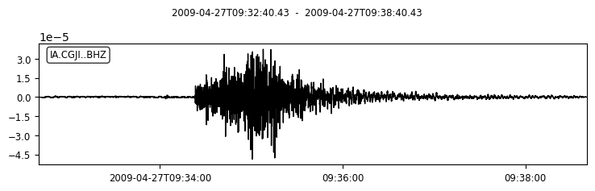
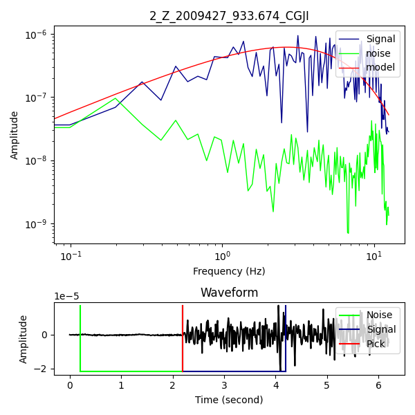

# W-SpecFit

The **W-SpecFit** application program stands for **Waveform Spectral Fitting**, written in the Python programming language. It is used to analyze seismic waveforms to obtain the physical parameter values contained within the waveforms.

---

## Features
- **Spectral Analysis**: Perform detailed spectral analysis of seismic waveforms.
- **Parameter Estimation**: Extract physical parameters such as amplitude, frequency, and attenuation.
- **Visualization**: Generate high-quality plots of waveform spectra.

---

## System Requirements
- Python 3.8 or higher
- Required Libraries:
  - `numpy`
  - `pandas`
  - `obspy`
  - `matplotlib`
  - `reportlab`

---

## Installation
1. Clone the repository:
   ```bash
   git clone https://github.com/aaxzrr/W-SpecFit.git
   ```
2. Navigate to the project directory:
   ```bash
   cd W-SpecFit
   ```
3. Install the required dependencies:
   ```bash
   pip install -r requirements.txt
   ```
4. Open running_specfit.ipynb for running example

---

## Example Output
Below is an example of the spectral fitting performed by W-SpecFit:

### Input Waveform 


### Spectral Fitting



